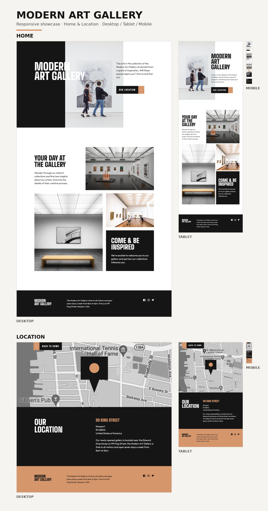

# Modern Art Gallery

A responsive two-page website for a modern art gallery, developed from a Figma design using HTML, Sass and Vite.

The project follows a mobile-first approach and includes dedicated layouts for mobile, tablet and desktop devices.

## Live Website

🌐 **[View Modern Art Gallery](https://neusgil.github.io/project-modern-art-gallery/)**

Explore the live website to test the responsive layouts, navigation between pages and interactive hover states.

## Preview



The preview showcases both pages of the project across the three main responsive layouts:

- Desktop — 1440px
- Tablet — 768px
- Mobile — 375px

## Pages

### Home

The Home page introduces the Modern Art Gallery and includes:

- Hero section
- Gallery introduction
- Exhibition imagery
- Inspiration section
- Navigation to the Location page
- Responsive footer with social links

### Location

The Location page includes:

- Gallery location map
- Gallery address
- Opening information
- Navigation back to the Home page
- Responsive footer with social links

## Responsive Design

The website was developed using a **mobile-first workflow**.

The main responsive breakpoints are:

- **Mobile:** 375px
- **Tablet:** 768px
- **Desktop:** 1200px and above

Each layout adapts the composition, typography, images, spacing and positioning while maintaining the visual identity of the original Figma design.

## Features

- Fully responsive two-page website
- Mobile-first development
- Navigation between Home and Location
- Interactive button hover states
- Social media icon hover effects
- Responsive image handling
- CSS Grid and Flexbox layouts
- Sass variables
- Reusable responsive mixins
- Sass partial architecture
- BEM naming methodology
- Local custom fonts

## Built With

- HTML5
- Sass / SCSS
- CSS Grid
- Flexbox
- Vite
- Git
- GitHub
- GitHub Pages

## Sass Structure

```text
scss/
├── abstracts/
│   ├── _variables.scss
│   └── _mixins.scss
│
├── base/
│   ├── _reset.scss
│   └── _typography.scss
│
├── components/
│   └── _buttons.scss
│
├── layout/
│   ├── _footer.scss
│   └── _hero.scss
│
├── pages/
│   ├── _home.scss
│   └── _location.scss
│
└── style.scss
```

## Typography

The project uses locally hosted fonts:

- **Big Shoulders — 900** for headings
- **Big Shoulders — 800** for buttons
- **Outfit — 400** for body text

## Design

The project was developed from a Figma reference with particular attention to:

- Typography
- Spacing
- Image proportions
- Grid composition
- Responsive behaviour
- Component positioning
- Visual hierarchy
- Hover interactions

The layouts were individually adapted and tested for mobile, tablet and desktop screen sizes.

## Author

**Neus Gil**

Frontend development practice project.
